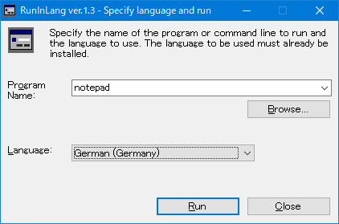
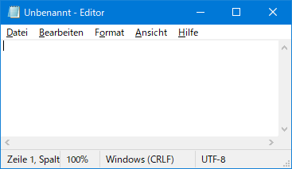

# RunInLang by katahiromz

This freeware can run a command line with a specific UI language.

# Usage

1. Double-click file `"RunInLang.exe"`.
2. Specify a program name or command line. Or you can drop the target program file onto this program.
3. Specify a language.
4. Click [OK] button. The command line will be executed in the specified language.

# Supported platforms

Windows XP/Vista/7/10/11

# License

MIT - Freeware

# Contact

Katayama Hirofumi MZ
katayama.hirofumi.mz@gmail.com
